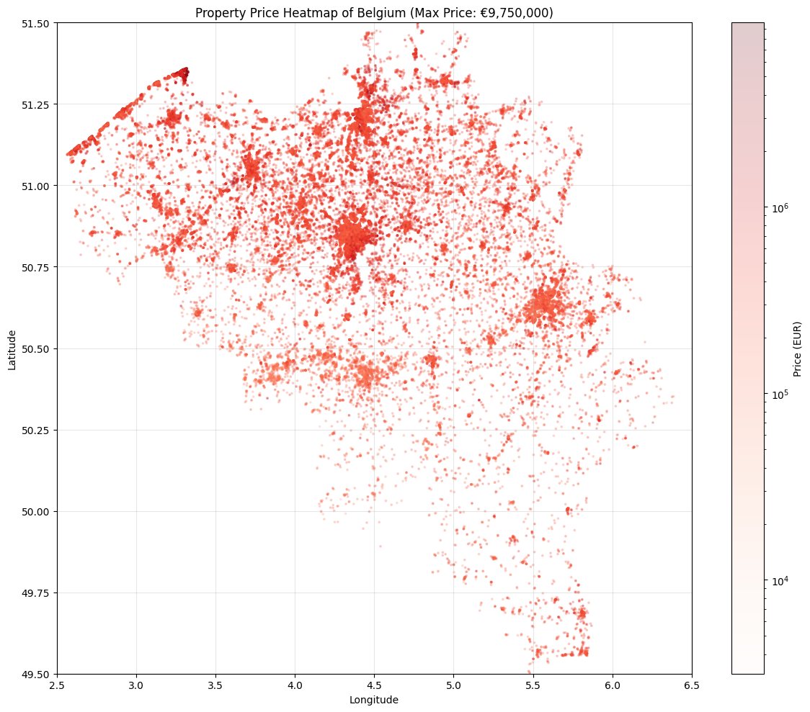

# ImmoEliza-Giraffe Scraping Project

<p align="center">
  
  
  
</p>

## Description

This project involves scraping real estate data from Belgian property websites to create a comprehensive dataset for the fictional company "ImmoEliza". The collected data includes property details such as price, location, size, number of rooms, and other features that can be used for machine learning models to predict property prices.

The dataset contains information about various property types across different regions in Belgium, with a focus on properties in the Luxembourg and Namur provinces. This data will serve as the foundation for building a property price prediction model in future stages of the project.

## Table of Contents

- [Installation](#installation)
- [Usage](#usage)
- [Features](#features)
- [Data Structure](#data-structure)
- [Visuals](#visuals)
- [Sources](#sources)
- [Contributors](#contributors)
- [Timeline](#timeline)
- [License](#license)

## Installation

To set up this project locally, follow these steps:

1. Clone the repository:
   ```bash
   git clone https://github.com/your-username/scraping-immoeliza-giraffe.git
   cd scraping-immoeliza-giraffe
   ```

2. Create a virtual environment:
   ```bash
   python -m venv venv
   ```

3. Activate the virtual environment:
   - On Windows:
     ```bash
     venv\Scripts\activate
     ```
   - On macOS/Linux:
     ```bash
     source venv/bin/activate
     ```

4. Install the required packages:
   ```bash
   pip install -r requirements.txt
   ```

## Usage

To run the scraper and collect property data:

```bash
python main.py
```

The scraped data is saved in `data/properties/data.csv` and can be used for subsequent analysis or machine learning models.

## Features

- **Comprehensive data collection**: Gathers over 40 features for each property
- **Automatic data cleaning**: Handles missing values and standardizes formats
- **Geographic diversity**: Covers properties across different Belgian provinces
- **Property type variety**: Includes houses, apartments, studios, and other property types

## Data Structure

The dataset includes the following properties:

| Feature | Description |
|---------|-------------|
| propertyId | Unique identifier for each property |
| localityName | Name of the city or town |
| postalCode | Postal code of the property location |
| typeOfProperty | Type of property (House, Apartment, etc.) |
| subtypeOfProperty | Subtype of property (Bungalow, Villa, Studio, etc.) |
| price | Property price in EUR |
| typeOfSale | Type of sale (Regular sale, Public sale, etc.) |
| numberOfRooms | Total number of rooms |
| livingArea | Habitable surface area in m² |
| equippedKitchen | Type of kitchen equipment |
| furnished | Whether the property is furnished (1=yes, 0=no, -1=unknown) |
| openFire | Whether the property has an open fire/fireplace |
| garden | Garden surface in m² (-1 if no garden) |
| surfaceOfGood | Total property area in m² |
| numberOfFacades | Number of facades |
| swimmingPool | Whether the property has a swimming pool |
| stateOfBuilding | Condition of the building |
| latitude | Geographic latitude |
| longitude | Geographic longitude |
| terraceSurface | Terrace surface area in m² |
| hasBasement | Whether the property has a basement |
| hasDressingRoom | Whether the property has a dressing room |
| hasDisabledAccess | Whether the property has disabled access |
| hasLift | Whether the property has an elevator |
| hasLaundryRoom | Whether the property has a laundry room |
| gardenOrientation | Orientation of the garden |
| streetFacadeWidth | Width of the facade facing the street |
| livingRoomSurface | Surface area of the living room in m² |
| electricalInstallationCertificate | Whether the property has an electrical installation certificate |
| gScore | G-score energy rating |
| heatingType | Type of heating system |
| hasHeatPump | Whether the property has a heat pump |
| hasPhotovoltaicPanels | Whether the property has solar panels |
| hasThermicPanels | Whether the property has thermic panels |
| hasCollectiveWaterHeater | Whether the property has a collective water heater |
| hasDoubleGlazing | Whether the property has double glazing |
| epcScore | Energy Performance Certificate score |
| primaryEnergyConsumptionPerSqm | Primary energy consumption per square meter |
| renovationObligation | Whether renovation is obligatory |
| cadastralIncome | Cadastral income value |
| parkingCountIndoor | Number of indoor parking spaces |
| parkingCountOutdoor | Number of outdoor parking spaces |
| parkingCountClosedBox | Number of closed box parking spaces |

Note: For boolean fields, 1=yes, 0=no, -1=unknown.

## Visuals


*Analysis of property prices based on location and features*

## Sources

Data for this project was collected from the following sources:
- [Immoweb](https://www.immoweb.be/)

Additional resources:
- [BeautifulSoup Documentation](https://www.crummy.com/software/BeautifulSoup/bs4/doc/)
- [Pandas Documentation](https://pandas.pydata.org/docs/)
- [Requests Documentation](https://docs.python-requests.org/en/latest/)
- [Pydash Documentation](https://pydash.readthedocs.io/en/latest/)

## Contributors

This project was developed as part of the BeCode AI training program by:

- [Elsarrive](https://github.com/elsarrive)
- [BlueHowl](https://github.com/BlueHowl)

## Timeline

- **Project Start**: 09/04/2025
- **Scraping Development**: 2 days
- **Testing and Iterating**: 2 day
- **Cleaning project**: 1 day
- **Project Completion**: 16/04/2025

## License

This project is licensed under the MIT License - see the LICENSE file for details.
